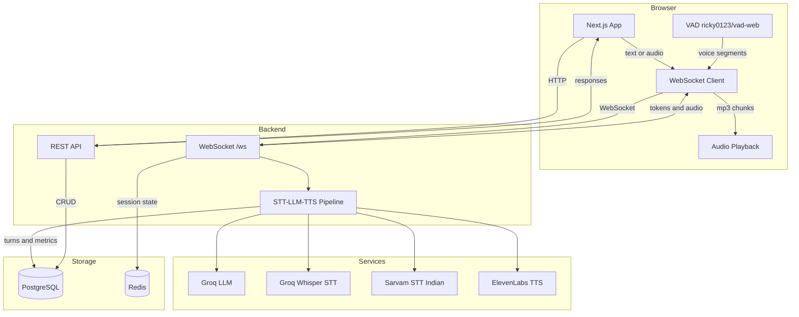
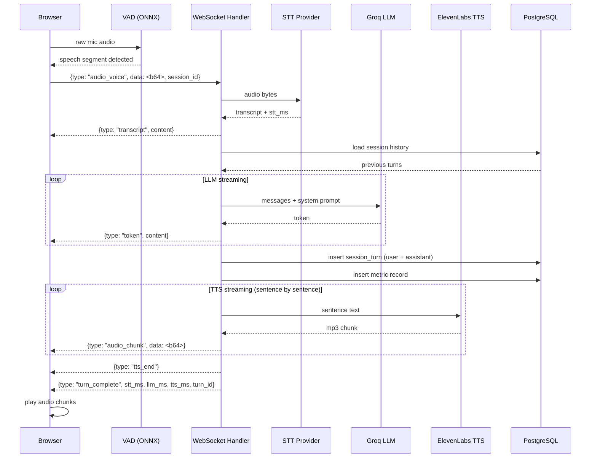
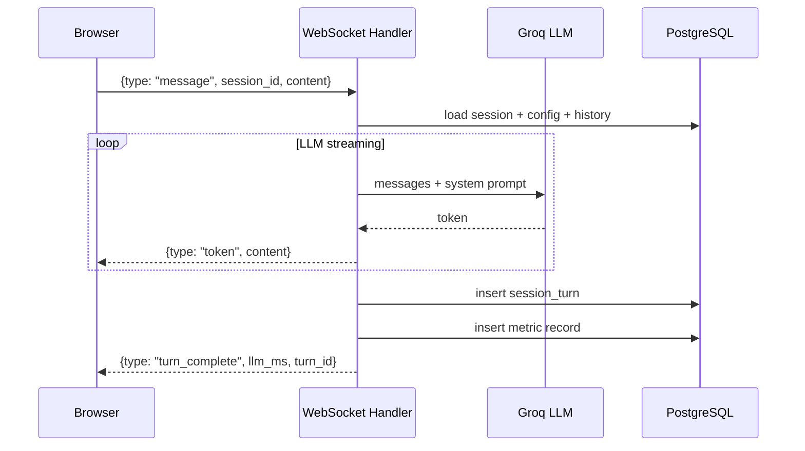
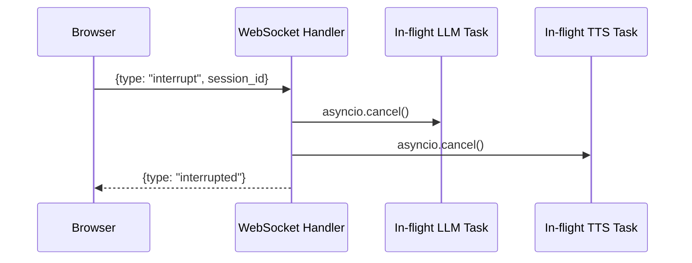
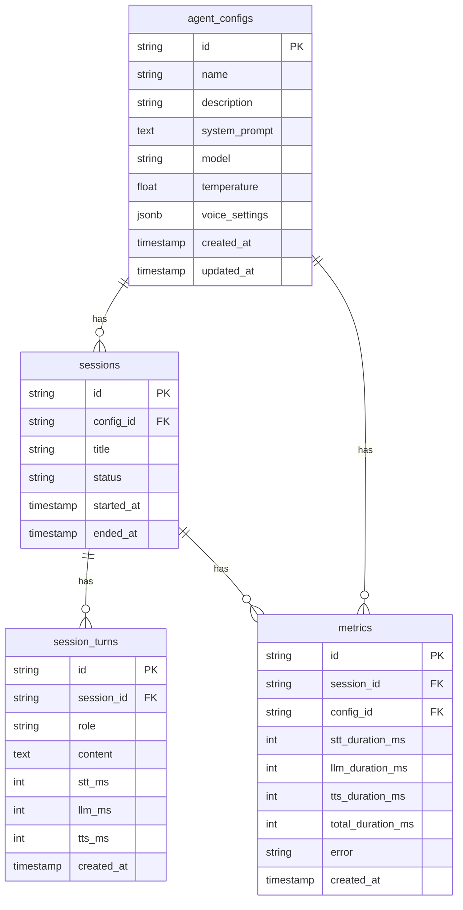
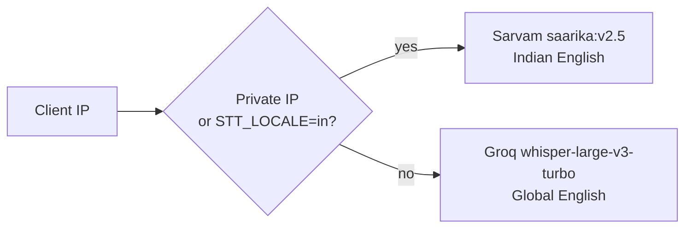

# Architecture — Voice Agent Lab

> Web-based platform for operators to configure, test, and monitor voice agents before production launch.

---

## System Overview



---

## Request Flow — Voice Turn



---

## Request Flow — Text Turn



---

## Barge-In (Interrupt)



---

## Directory Structure

```
tvaram/
├── api/                        # FastAPI backend
│   ├── main.py                 # App entrypoint, lifespan, router registration
│   ├── config/
│   │   ├── db.py               # Database singleton (asyncpg, pool_size=20)
│   │   ├── cache.py            # RedisManager singleton
│   │   ├── http.py             # Shared httpx.AsyncClient
│   │   └── logger.py           # Structured logging
│   ├── core/
│   │   ├── deps.py             # FastAPI Depends: db session, redis, handlers
│   │   └── exceptions.py       # Custom HTTP exceptions
│   ├── app/
│   │   ├── agent_configs/      # Config CRUD (models, crud, handler, router)
│   │   ├── sessions/           # Session CRUD + listing
│   │   ├── session_turns/      # Turn storage with pagination
│   │   ├── metrics/            # Latency metrics CRUD + summary endpoint
│   │   ├── llm_models/         # LLM registry + seeder
│   │   ├── voices/             # Voice registry
│   │   ├── llms/               # LLM providers (Groq)
│   │   ├── stt/                # STT providers (Whisper, Sarvam) + factory
│   │   ├── tts/                # TTS provider (ElevenLabs)
│   │   └── ws/                 # WebSocket endpoint + pipeline handler
│   └── migrations/             # Alembic migrations
│
└── client/                     # Next.js frontend
    └── src/
        ├── app/
        │   ├── page.tsx                # Home
        │   ├── configs/                # Agent config CRUD UI
        │   ├── sessions/[id]/          # Live session + voice interaction
        │   ├── history/                # Session history list + playback
        │   └── metrics/                # Latency dashboard (Recharts)
        ├── providers/
        │   ├── WebsocketProvider.tsx   # Global WS context, pub/sub, reconnect
        │   ├── QueryProvider.tsx       # TanStack Query
        │   └── ThemeProvider.tsx       # Dark/light mode
        ├── services/                   # API clients (sessions, configs, metrics)
        └── types/                      # TypeScript interfaces
```

---

## Database Schema



---

## WebSocket Protocol

All messages are JSON over a single persistent WebSocket connection at `/ws`.

### Client → Server

| `type` | Fields | Description |
|--------|--------|-------------|
| `message` | `session_id`, `content` | Send text turn |
| `audio_voice` | `session_id`, `data` (base64), `mime_type` | Send audio for STT→LLM→TTS |
| `interrupt` | `session_id` | Cancel in-flight LLM/TTS |

### Server → Client

| `type` | Fields | Description |
|--------|--------|-------------|
| `transcript` | `content` | STT result |
| `token` | `content` | Streaming LLM token |
| `audio_chunk` | `data` (base64 mp3) | TTS audio frame |
| `tts_end` | — | TTS stream complete |
| `turn_complete` | `turn_id`, `stt_ms?`, `llm_ms?`, `tts_ms?` | Turn finished with latencies |
| `interrupted` | — | Barge-in acknowledged |
| `error` | `message` | Pipeline error |

---

## STT Provider Selection

Locale is detected from client IP at WebSocket connection time. Override via `STT_LOCALE` env var.



---

## REST API

| Method | Path | Description |
|--------|------|-------------|
| `GET` | `/api/configs` | List agent configs |
| `POST` | `/api/configs` | Create config |
| `GET` | `/api/configs/{id}` | Get config |
| `PUT` | `/api/configs/{id}` | Update config |
| `DELETE` | `/api/configs/{id}` | Delete config |
| `GET` | `/api/sessions` | List sessions (paginated) |
| `POST` | `/api/sessions` | Create session |
| `GET` | `/api/sessions/{id}` | Get session |
| `GET` | `/api/sessions/{id}/turns` | Get turns (paginated, max 200) |
| `GET` | `/api/sessions/by-config/{config_id}` | Sessions for a config |
| `GET` | `/api/metrics/summary?config_id=` | Latency summary (avg/min/max/p50/p90/p99) |
| `GET` | `/api/voices` | List available TTS voices |
| `GET` | `/api/llm-models` | List available LLM models |

---

## Key Design Decisions

### 1. Single WebSocket per Client
One persistent connection handles both text and voice. Message `type` field routes to the correct handler. Avoids connection overhead per turn and enables server-push (tokens, audio chunks) without polling.

### 2. Sentence-Level TTS Streaming
ElevenLabs is called once per sentence (split on punctuation), not once for the full response. First audio chunk plays while remaining sentences are still being generated — reduces perceived TTS latency.

### 3. Locale-Based STT Routing
Sarvam AI handles Indian-accented English better than Whisper for `en-IN`. Selection is automatic based on client IP, with an env var override for development.

### 4. No Explicit Session End
Sessions are created via `POST /api/sessions` and never explicitly closed. `ended_at` is derived from the last turn's `created_at`. This simplifies client logic — no teardown handshake needed.

### 5. Per-Stage Latency Capture
Every turn stores `stt_ms`, `llm_ms`, `tts_ms` independently in both `session_turns` and `metrics`. This enables per-stage p50/p90/p99 breakdowns in the dashboard rather than just total latency.

---

## Environment Variables

| Variable | Required | Description |
|----------|----------|-------------|
| `DATABASE_URL` | Yes | PostgreSQL async URL (`postgresql+asyncpg://...`) |
| `GROQ_API_KEY` | Yes | Groq API key (LLM + Whisper STT) |
| `ELEVENLABS_API_KEY` | Yes | ElevenLabs TTS key |
| `SARVAM_API_KEY` | No | Sarvam STT key (Indian English) |
| `REDIS_URL` | No | Redis URL (default: `redis://localhost:6379`) |
| `STT_LOCALE` | No | Override STT provider: `in` or `global` |
